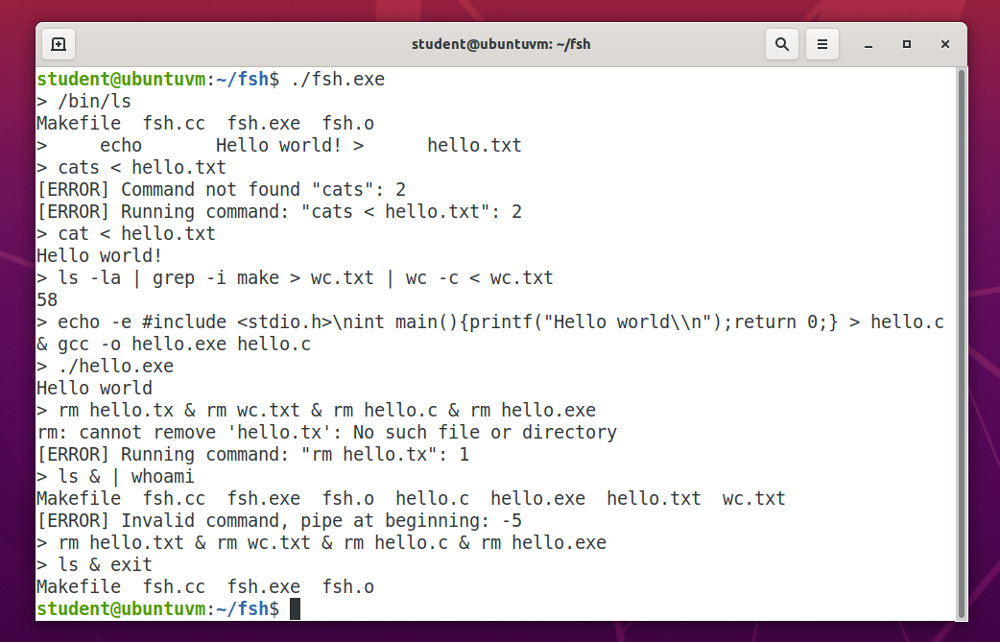

# **fsh**

### **Summary**

`fsh` is a simple Unix shell program. It supports chaining commands with the `&` operator, piping the output and input of commands to and from other commands with the `|` operator, redirecting the output and input of commands to and from files using the `>` and `<` operators, searching the `PATH` environment variable to find a valid command to run, and running commands with multiple arguments. It also prints out informative error messages. 

To compile fsh simply run `make` from the root directory and run the program using `./fsh.exe`. 

### **Example**

Below is an example terminal session using `fsh`:

### **Credits**

Developer and Creator – Forrest Feaser [@fdfea](https://github.com/fdfea)
